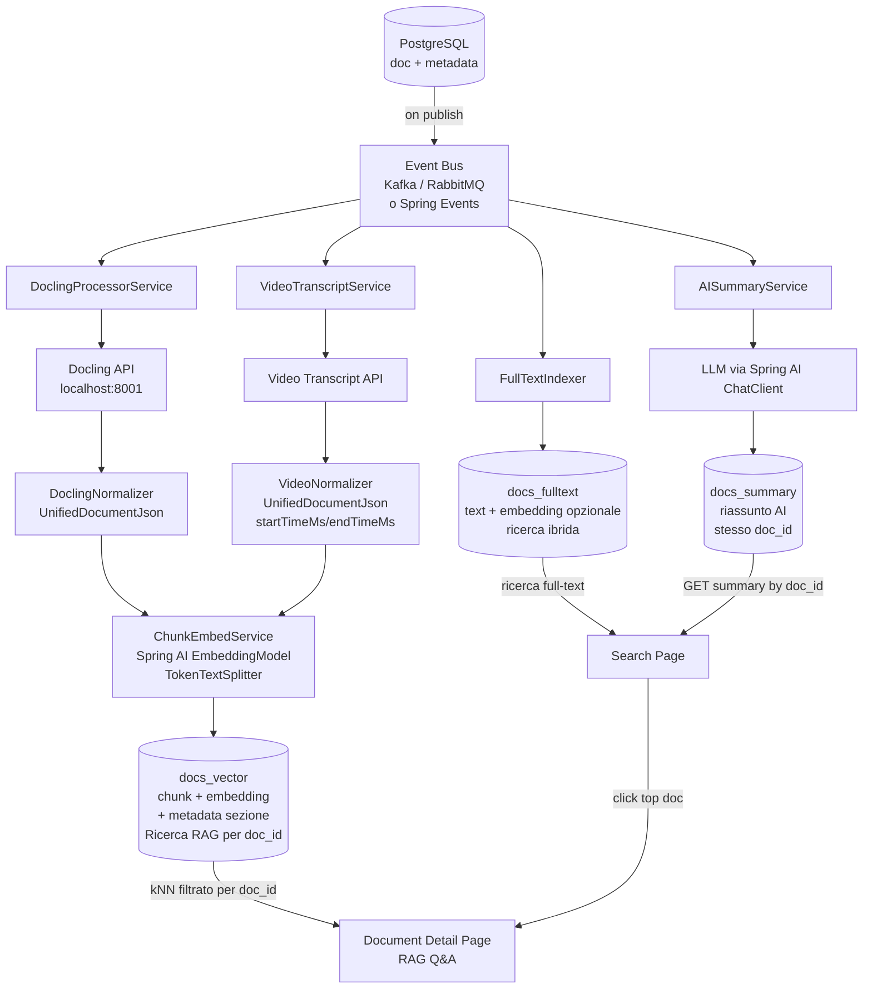

# Analisi Architetturale — RAG con Spring AI + Docling

> Revisione basata sul codebase `spring-ai-rag` e sui requisiti descritti dal cliente.

---

## Executive Summary

| # | Stato |
|---|-------|
| 1 | Separazione in 3 indici ES è corretta e scalabile |
| 2 | Normalizzazione unificata PDF/video è il punto di forza chiave |
| 3 | `UnifiedDocumentJson` è già il modello giusto — già implementato nel codebase |
| 4 | La proposta hybrid search (embedding sul full-text index) è valida e raccomandabile |
| 5 | Il rischio principale è la **consistenza distribuita** tra i 3 step asincroni |

---

## Architettura dei 3 Indici ES



---

## Cosa è già implementato nel codebase

Nel modulo `spring-ai-rag` è già presente:

| Componente | File | Stato |
|------------|------|-------|
| Modello normalizzato | `model/UnifiedDocumentJson.java` | ✅ Implementato |
| Sezioni con timestamp | `model/DocumentSection.java` | ✅ Pronto per video |
| Ingestione con chunking | `docling/DoclingController /parse` | ✅ Implementato |
| RAG filtrato per `docId`, `chapter`, `meta.*` | `docling/DoclingController /ask` | ✅ Implementato |
| Lista documenti indicizzati | `docling/DoclingController /documents` | ✅ Implementato |

**Manca:**
- `AISummaryService` → indice `docs_summary`
- `VideoNormalizerService`
- Pipeline event-driven (oggi è sincrona via HTTP)
- Gestione idempotenza al re-publish

---

## Rischi e come mitigarli

### 1. Consistenza distribuita — il rischio più serio

Quando pubblichi, lanci 3 processi asincroni indipendenti. Se il summary va in errore ma il vector index è già stato scritto, hai uno stato inconsistente.

**Soluzione** — aggiungi una tabella Postgres di stato pipeline:

```sql
CREATE TABLE doc_pipeline_status (
    doc_id      UUID        NOT NULL,
    step        VARCHAR(30) NOT NULL,  -- 'fulltext', 'summary', 'vector'
    status      VARCHAR(20) NOT NULL,  -- 'pending', 'running', 'done', 'failed'
    error_msg   TEXT,
    updated_at  TIMESTAMP   DEFAULT NOW(),
    PRIMARY KEY (doc_id, step)
);
```

Ogni servizio aggiorna il proprio step. La UI può mostrare lo stato di elaborazione in tempo reale.

---

### 2. Idempotenza al re-publish

Se l'utente modifica e ripubblica, occorre **eliminare i chunk vecchi** prima di re-indicizzare:

```java
// prima del re-index vettoriale
FilterExpressionBuilder b = new FilterExpressionBuilder();
vectorStore.delete(b.eq("docId", docId).build());

// per il summary: upsert by doc_id
// per il fulltext: update by doc_id (ES upsert nativo)
```

---

### 3. Hybrid search sul full-text index

La proposta di aggiungere `embedding` all'indice full-text è corretta, ma va distinta semanticamente:

| Indice | Granularità embedding | Scopo |
|--------|----------------------|-------|
| `docs_fulltext` | Intero documento / abstract | Ranking globale, ricerca ibrida |
| `docs_vector` | Chunk (~400 token) | RAG preciso, Q&A document-scoped |

Usa Elasticsearch **RRF (Reciprocal Rank Fusion)** nativamente per combinare BM25 + kNN nello stesso indice senza implementazione manuale.

---

### 4. Docling latency per file grandi

Non usare `@Async` semplice — con PDF di 300+ pagine Docling può impiegare 30-60 secondi.  
**Usa una coda reale** (RabbitMQ/Kafka) con consumer separato:

- La risposta al "pubblica" è immediata (HTTP 202 Accepted)
- Il processing avviene in background
- Retry automatico in caso di timeout Docling
- Dead letter queue per errori persistenti

---

## Schema JSON Normalizzato

Formato unificato già implementato in `UnifiedDocumentJson`. Funziona identicamente per PDF e video — la normalizzazione è il punto di disaccoppiamento corretto.

### Da Docling (PDF/DOC)

```json
{
  "docId": "550e8400-e29b-41d4-a716-446655440000",
  "fileName": "contratto.pdf",
  "sourceType": "PDF",
  "sections": [
    {
      "sectionId": "section-3",
      "title": "Allegato A — Prezzi",
      "pageNumber": 12,
      "startTimeMs": null,
      "endTimeMs": null,
      "text": "Il prezzo unitario è...",
      "metadata": { "category": "legal", "language": "it" }
    }
  ]
}
```

### Da Video Transcript (stessa struttura)

```json
{
  "docId": "550e8400-e29b-41d4-a716-446655440001",
  "fileName": "riunione-board.mp4",
  "sourceType": "VIDEO",
  "sections": [
    {
      "sectionId": "segment-42",
      "title": null,
      "pageNumber": null,
      "startTimeMs": 183000,
      "endTimeMs": 217000,
      "text": "Come dicevo, il contratto prevede...",
      "metadata": { "speaker": "speaker_1" }
    }
  ]
}
```

Il `ChunkEmbedService` è identico per entrambe le sorgenti.

---

## Schema Indici Elasticsearch

### `docs_fulltext` — ricerca full-text + hybrid

```json
{
  "mappings": {
    "properties": {
      "doc_id":     { "type": "keyword" },
      "file_name":  { "type": "keyword" },
      "source_type":{ "type": "keyword" },
      "text":       { "type": "text", "analyzer": "italian" },
      "embedding":  { "type": "dense_vector", "dims": 768, "index": true, "similarity": "cosine" },
      "created_at": { "type": "date" },
      "metadata":   { "type": "object", "dynamic": true }
    }
  }
}
```

### `docs_summary` — riassunti AI

```json
{
  "mappings": {
    "properties": {
      "doc_id":       { "type": "keyword" },
      "file_name":    { "type": "keyword" },
      "source_type":  { "type": "keyword" },
      "summary":      { "type": "text" },
      "generated_at": { "type": "date" },
      "model":        { "type": "keyword" }
    }
  }
}
```

### `docs_vector` (= `spring-ai-document-index`) — RAG vettoriale

```json
{
  "mappings": {
    "properties": {
      "doc_id":         { "type": "keyword" },
      "chunk_id":       { "type": "keyword" },
      "text":           { "type": "text" },
      "embedding":      { "type": "dense_vector", "dims": 768, "index": true, "similarity": "cosine" },
      "section_title":  { "type": "keyword" },
      "page_number":    { "type": "integer" },
      "start_time_ms":  { "type": "long" },
      "end_time_ms":    { "type": "long" },
      "file_name":      { "type": "keyword" },
      "source_type":    { "type": "keyword" },
      "metadata":       { "type": "object", "dynamic": true }
    }
  }
}
```

---

## Componenti Spring AI

### Dipendenze Maven

```xml
<!-- Vector Store Elasticsearch -->
<dependency>
    <groupId>org.springframework.ai</groupId>
    <artifactId>spring-ai-starter-vector-store-elasticsearch</artifactId>
</dependency>

<!-- Ollama (embedding + chat) -->
<dependency>
    <groupId>org.springframework.ai</groupId>
    <artifactId>spring-ai-starter-model-ollama</artifactId>
</dependency>
```

### Utilizzo nei servizi

```java
// Embedding
@Autowired EmbeddingModel embeddingModel;

// Chunking configurabile
TokenTextSplitter splitter = new TokenTextSplitter(
    400,    // defaultChunkSize (token)
    200,    // minChunkSizeChars
    5,      // minChunkLengthToEmbed
    10000,  // maxNumChunks
    true    // keepSeparator
);

// Vector store (RAG)
@Autowired ElasticsearchVectorStore vectorStore;

// Ricerca filtrata per documento
FilterExpressionBuilder b = new FilterExpressionBuilder();
Filter.Expression filter = b.eq("docId", docId).build();
SearchRequest req = SearchRequest.builder()
    .query(question)
    .filterExpression(filter)
    .topK(8)
    .build();
List<Document> chunks = vectorStore.similaritySearch(req);

// Summary generation
@Autowired ChatClient chatClient;
String summary = chatClient.prompt()
    .user("Riassumi in 3 paragrafi il seguente testo:\n\n" + fullText)
    .call()
    .content();
```

### application.properties

```properties
# Ollama
spring.ai.ollama.base-url=http://localhost:11434
spring.ai.ollama.embedding.options.model=nomic-embed-text
spring.ai.ollama.chat.options.model=llama3.2:3b
spring.ai.ollama.chat.options.num-ctx=4096

# Elasticsearch
spring.elasticsearch.uris=http://localhost:9200
spring.ai.vectorstore.elasticsearch.index-name=spring-ai-document-index
spring.ai.vectorstore.elasticsearch.dimensions=768
spring.ai.vectorstore.elasticsearch.similarity=cosine
```

---

## Roadmap Implementativa

| Priorità | Componente | Motivazione |
|----------|------------|-------------|
| 1 | `AISummaryService` + indice `docs_summary` | Quick win, alto valore per l'utente |
| 2 | Tabella `doc_pipeline_status` su Postgres | Abilita UI di stato e debugging errori |
| 3 | Idempotenza re-publish (delete + reindex) | Necessario prima del go-live |
| 4 | `VideoNormalizerService` | Riusa lo stesso `ChunkEmbedService` già esistente |
| 5 | Hybrid search con RRF su `docs_fulltext` | Miglioramento qualità ricerca globale |
| 6 | Event bus (RabbitMQ) per pipeline asincrona | Obbligatorio per produzione con file grandi |

---

## Note Finali

- **L'architettura è valida.** La scelta di normalizzare PDF e video nello stesso `UnifiedDocumentJson` prima del chunking è la decisione più strategica: disaccoppia completamente le sorgenti dal layer di embedding.
- Il `spring-ai-rag` già implementa la parte vettoriale (indice 3). I prossimi step concreti sono l'`AISummaryService` (indice 2) e la tabella di stato pipeline.
- Per produzione, sostituire `@Async` con RabbitMQ/Kafka per la pipeline Docling (file grandi, retry, dead letter).
