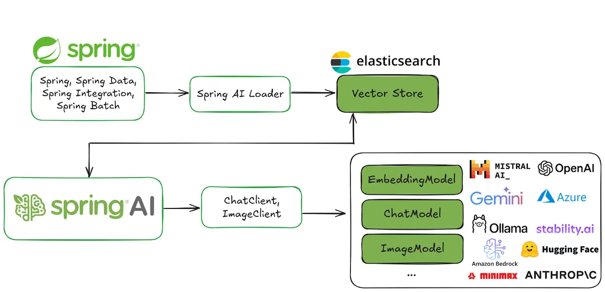

# Spring AI and Elasticsearch as your vector database

Full article [Spring AI and Elasticsearch as your vector database](https://www.elastic.co/search-labs/blog/spring-ai-elasticsearch-application).



## Come funziona

Il progetto implementa un pattern **RAG (Retrieval-Augmented Generation)**:

1. **Ingest** — un PDF viene caricato via REST, suddiviso in chunk con `TokenTextSplitter` e vettorializzato tramite il modello di embedding (Ollama `nomic-embed-text`). I chunk e i relativi vettori vengono salvati su Elasticsearch.
2. **Query** — la domanda dell'utente viene vettorializzata e confrontata con i chunk salvati tramite ricerca kNN. I chunk più simili vengono usati come contesto e passati al modello LLM (Ollama `gemma4`) che genera la risposta finale.

```
PDF ──► TokenTextSplitter ──► nomic-embed-text ──► Elasticsearch (dense_vector 768 dim)
                                                          │
Domanda ──► nomic-embed-text ──► kNN search ─────────────┘
                                      │
                               top-K chunk
                                      │
                               gemma4 (LLM) ──► Risposta
```

## Dipendenze

* JDK 21+
* Maven
* Elasticsearch in esecuzione su `localhost:9200`
* [Ollama](https://ollama.com) in esecuzione su `localhost:11434` con i modelli:
  * `nomic-embed-text` — embedding (768 dimensioni)
  * `gemma4:e2b` — chat / generazione testo

Per scaricare i modelli Ollama:
```bash
ollama pull nomic-embed-text
ollama pull gemma4:e2b
```

## Configurazione (`application.properties`)

```properties
spring.application.name=spring_ai-elasticsearch-vector-search

spring.servlet.multipart.max-file-size=20MB
spring.servlet.multipart.max-request-size=20MB

# Ollama
spring.ai.ollama.base-url=http://localhost:11434
spring.ai.ollama.chat.options.model=gemma4:e2b
spring.ai.ollama.embedding.model=nomic-embed-text

# Elasticsearch
spring.elasticsearch.uris=http://localhost:9200
spring.elasticsearch.username=elastic
spring.elasticsearch.password=${ELASTICSEARCH_PASSWORD}
spring.ai.vectorstore.elasticsearch.initialize-schema=true
spring.ai.vectorstore.elasticsearch.dimensions=768
```

La variabile `ELASTICSEARCH_PASSWORD` va impostata come variabile d'ambiente:
```bash
export ELASTICSEARCH_PASSWORD=la_tua_password
```

## Build e avvio

```bash
mvn clean package -DskipTests
java -jar target/spring_ai-elasticsearch-vector-search-1.0.0-SNAPSHOT.jar
```

## Endpoint REST

### Indicizzare un PDF

```bash
curl -X POST http://localhost:8080/rag/ingest \
  -F "file=@/percorso/al/documento.pdf"
```

Risposta attesa: `Done!`

### Interrogare il sistema RAG

```bash
curl "http://localhost:8080/rag/query?question=La+tua+domanda+qui"
```

## Verifica su Elasticsearch

### Lista indici
```bash
curl -u elastic:${ELASTICSEARCH_PASSWORD} \
  "http://localhost:9200/_cat/indices?v"
```

### Contare i documenti indicizzati
```bash
curl -u elastic:${ELASTICSEARCH_PASSWORD} \
  "http://localhost:9200/spring-ai-document-index/_count?pretty"
```

### Leggere i chunk (testo + metadati)
```bash
curl -u elastic:${ELASTICSEARCH_PASSWORD} \
  -H "Content-Type: application/json" \
  "http://localhost:9200/spring-ai-document-index/_search?pretty" \
  -d '{"size": 5, "_source": ["content", "metadata"], "query": {"match_all": {}}}'
```

### Vedere il vettore embedding di un documento
```bash
curl -u elastic:${ELASTICSEARCH_PASSWORD} \
  -H "Content-Type: application/json" \
  "http://localhost:9200/spring-ai-document-index/_search?pretty" \
  -d '{"size": 1, "_source": ["content", "metadata", "embedding"], "query": {"match_all": {}}}'
```

> Il campo `embedding` è un `dense_vector` di 768 dimensioni: Elasticsearch lo esclude dal `_source` per default, va richiesto esplicitamente.
